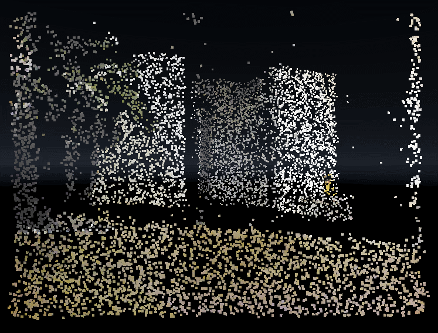

# Orbbec Unity Sample

## Prerequisites
* Windows machine
* Orbbec Astra
* Unity 2019.4 (could work for others, but only tested with this)
* Visual Studio 2019 (could work for others, but only tested with this)

## Features
* Depth stream visualiser
* Colour stream visualiser
* Body tracking (joints only). If you stand far back enough, spheres will appear representing joints
* VFX Graph example using both depth and colour streams

## Demos
* `VisualisersExamples` scene contains a body tracking example and colour + depth streams rendered to textures in the top left.
* `VFXGraphExample` scene shows a VFX example using the colour stream for particle colour and depth stream for particle position.

## How to use
* The AstraController object will allow you to turn colour, depth and body streams on and off
* If you have a body tracking license, modify the line ` AstraSdkInterop.SetLicenceKey("<INSERT YOUR LICENCE KEY>");` in `AstraController.cs` with your license

## How to update
* Download the latest Orbbec Astra SDK and unzip
* Copy the contents of `{OrbbecSDK}/bin` (except for exe files) into `UnityAstra/Assets/SDK/Astra/amd64`

## Known issues
* Free body tracking will only work until March 21 2020
* If you have your own licence, add it in AstraController.cs
* Colour and depth streams are misaligned, currently Orbbec SDK's depth registration does not help much
* ColourToTexture and DepthToTexture implementations could be improved. Currently data type mismatches and lack of read/writable option for RenderTextures created in the UI makes the implementation sub-optimal.
